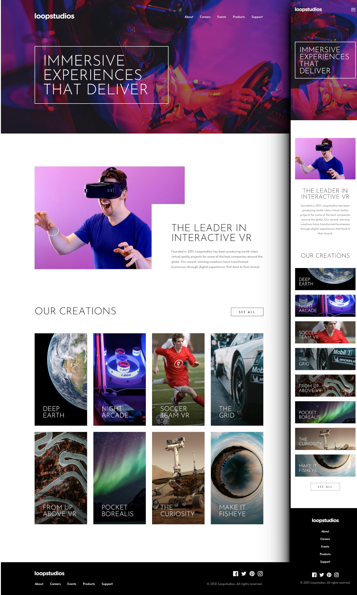

## Table of contents

- [Overview](#overview)
  - [Screenshot](#screenshot)
  - [Links](#links)
- [My process](#my-process)
  - [Built with](#built-with)
  - [Continued development](#continued-development)
- [Author](#author)

## Overview

### The Project

Users should be able to:

- View the optimal layout for the site depending on their device's screen size
- See hover states for all interactive elements on the page

### Screenshot

### Links

- Solution URL: [Neto Silva - LoopStudio Repository](https://github.com/Netosilv4/LoopStudios-Junior)

## My process

### Built with

- Semantic HTML5 markup
- CSS custom properties
- Flexbox
- JavaScript
- Mobile-first workflow

### Continued development

JavaScript menu and image switch still in progress 

## Author

- Website - [Neto Silva](https://netosilv4.github.io/)
- Frontend Mentor - [@Netosilv4](https://www.frontendmentor.io/profile/Netosilv4)

